# PlantUML CheatSheet
#### Left to right
```
left to right direction
```
#### New Diagram
```markdown
@startuml
!include https://raw.githubusercontent.com/patrik-csak/one-dark-plantuml-theme/v1.0.1/theme.puml
!pragma layout smetana
allowmixing
@enduml
```

#### Components
```plantuml
@startuml
!include https://raw.githubusercontent.com/patrik-csak/one-dark-plantuml-theme/v1.0.1/theme.puml
!pragma layout smetana
allowmixing

action action
actor actor
agent agent
artifact artifact
boundary boundary
card card
circle circle
cloud cloud
collections collections
component component
control control
database database
entity entity
file file
folder folder
frame frame
hexagon hexagon
interface interface
label label
node node
package package
person person
process process
queue queue
rectangle rectangle
stack stack
storage storage
usecase usecase
@enduml
```

#### Nestable Components

```plantuml
@startuml
!include https://raw.githubusercontent.com/patrik-csak/one-dark-plantuml-theme/v1.0.1/theme.puml
!pragma layout smetana
left to right direction
allowmixing
@startuml
action action {
}
artifact artifact {
}
card card {
}
cloud cloud {
}
component component {
}
database database {
}
file file {
}
folder folder {
}
frame frame {
}
node node {
}
package package {
}
process process {
}
queue queue {
}
rectangle rectangle {
}
stack stack {
}
storage storage {
}
@enduml
```
